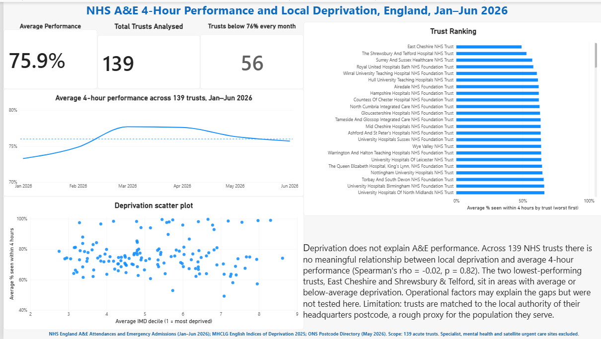

# NHS A&E 4-Hour Performance vs Local Deprivation (England, Jan–Jun 2026)

Does the level of deprivation in an NHS trust's local area explain how well the trust performs against the 4-hour A&E standard?

I combined six months of NHS England A&E data with trust locations and the English Indices of Deprivation 2025, tested the relationship across 139 acute trusts, and built a Power BI dashboard to present the results.



## Key findings

- **Average performance sat close to the 76% standard.** Across the 139 trusts it was 75.9% over the six months, peaking at 77.7% in March and falling back to 75.7% by June.
- **No relationship with deprivation.** Trust-level Spearman correlation between local deprivation and average 4-hour performance was ρ = -0.02 (p = 0.82, n = 139).
- **The weakest trusts are not in the most deprived areas.** East Cheshire NHS Trust (49.2% average, IMD decile 7.1) and The Shrewsbury and Telford Hospital NHS Trust (52.9%, decile 5.7) had the lowest averages and sit in average or less-deprived areas.
- **Under-performance is persistent.** 56 of 139 trusts (40%) were below 76% in every one of the six months.

| Month | Jan | Feb | Mar | Apr | May | Jun |
|---|---|---|---|---|---|---|
| Average % seen within 4 hours | 73.3 | 74.9 | 77.7 | 77.6 | 76.3 | 75.7 |

In this sample, deprivation does not explain differences between trusts. Whether operational factors such as staffing, bed capacity or discharge delays do was **not tested**.

## Approach

1. **Load** six monthly NHS England "A&E by provider" Excel files and combine them into one panel.
2. **Scope** to comparable acute trusts (see the exclusion table below).
3. **Locate** each trust by joining the NHS ODS trust list (headquarters postcode) to the ONS Postcode Directory to get its local authority.
4. **Add deprivation** by averaging IMD 2025 LSOA deciles up to local authority level (1 = most deprived, 10 = least deprived).
5. **Test** the relationship with a trust-level Spearman correlation. Each trust counts once, and a rank-based test is used because IMD deciles are ordinal.
6. **Present** the results in Power BI.

## Data cleaning decisions

| Step | Trusts remaining | Reason |
|---|---|---|
| Organisations reporting in all six months | 190 | Removes walk-in and urgent care sites that appear or disappear during the year |
| With a 4-hour % reported | 181 | Removes 9 specialist and mental health trusts with no general A&E, where the metric doesn't apply |
| Matched to an active NHS trust record in ODS | 139 | Removes 42 organisations, mostly satellite sites that report under a parent trust. It also removes North Bristol NHS Trust, which closed on 30 June 2026 (see Limitations) |

Other data problems handled in the script:

- **Spreadsheet layout:** the files are legacy `.xls` with title rows above the header, an "England" total row and trailing blank rows.
- **Percentages stored as text** were converted to numeric.
- **Mid-year rename:** one trust changed name in April under the same code (Warrington and Halton Teaching Hospitals became North Cheshire and Mersey). Each code now uses its latest name, so the trust isn't counted twice in charts.
- **Local authority boundary change:** Barnsley and Sheffield were given new codes in April 2025. The ONS postcode file uses the new codes and the IMD file the old ones, so they are mapped back before joining. Without this, two trusts silently drop out.
- **Integrity checks:** the script asserts that every trust has a local authority, a deprivation value and exactly six monthly rows.

## Limitations

- **Headquarters postcode is a rough proxy for catchment.** Large trusts serve patients across several local authorities, which can weaken any real relationship.
- **Six months only.** There is no seasonal comparison with previous years, so the March peak and later decline can't be separated from normal variation.
- **Averages are unweighted.** "Average performance" is the mean of trust percentages, not weighted by attendances, and local authority deprivation is the unweighted mean of LSOA deciles.
- **The measure combines all department types.** Trusts whose activity is mostly minor injury units score close to 100% and aren't directly comparable with major A&E departments.
- **Association only.** Nothing here supports a causal claim.
- **One trust excluded for administrative reasons.** The ODS file shows trusts as they are today, so North Bristol (which reported all six months) is dropped. Setting `KEEP_TRUSTS_CLOSED_DURING_STUDY = True` in the script keeps it.

## Possible next steps

- Repeat the analysis for Type 1 (major A&E) performance only.
- Weight by attendances and use population-weighted deprivation.
- Use patient-origin data to measure the deprivation of the population each trust actually serves.
- Extend to a full year, or compare with the same months in 2025.

## How to run

Requires Python 3.9 or later.

```bash
git clone https://github.com/TheyvidA/Nhs-ae-deprivation-analysis.git
cd Nhs-ae-deprivation-analysis
pip install pandas xlrd scipy matplotlib
```
1. Download the input files (links below) into one folder. The raw data is not included in this repository because of file size (the ONS postcode file is about 1.4 GB).
2. Edit the `CONFIG` block at the top of `ae_deprivation_analysis.py` to set `DATA_DIR`, `OUTPUT_DIR` and the file names.
3. Run:

```bash
python ae_deprivation_analysis.py
```

The script prints the exclusion funnel, monthly averages, the lowest-performing trusts and the correlation results. It saves the scatter plot and the dataset the dashboard uses (`ae_deprivation_monthly.csv`) to `OUTPUT_DIR`. In Power BI, point the data source at that CSV.

Expected checkpoint values: 139 trusts, 834 rows, 56 trusts below target in every month, Spearman ρ ≈ -0.02.

## Data sources

| Dataset | Source |
|---|---|
| A&E Attendances and Emergency Admissions, monthly provider files (Jan–Jun 2026) | [NHS England](https://www.england.nhs.uk/statistics/statistical-work-areas/ae-waiting-times-and-activity/) |
| NHS trust list with postcodes (report "etr") | [NHS ODS Data Search and Export](https://www.odsdatasearchandexport.nhs.uk/) |
| ONS Postcode Directory (May 2026) | [ONS Open Geography Portal](https://geoportal.statistics.gov.uk/) |
| English Indices of Deprivation 2025, File 2: Domains of deprivation | MHCLG, on GOV.UK |

## Repository structure

```
├── ae_deprivation_analysis.py   # full pipeline
├── dashboard/
│   ├── ae_wait_times_dashboard.pbix
│   └── ae_wait_times_dashboard.pdf
├── images/
│   └── dashboard.png
└── README.md
```

## Tools

Python (pandas, SciPy, Matplotlib), Power BI.

## Author

David Adebayo, MSc Data Science, UWE Bristol.
[Portfolio](https://theyvida.github.io/AdebayoDavid.github.io/) · [LinkedIn](https://www.linkedin.com/in/david-a-adebayo-6669a8159/)

## Licence and attribution

Contains public sector information licensed under the Open Government Licence v3.0.

ONS Postcode Directory:
Contains OS data © Crown copyright and database right 2026.
Contains Royal Mail data © Royal Mail copyright and database right 2026.
Source: Office for National Statistics licensed under the Open Government Licence v.3.0.
